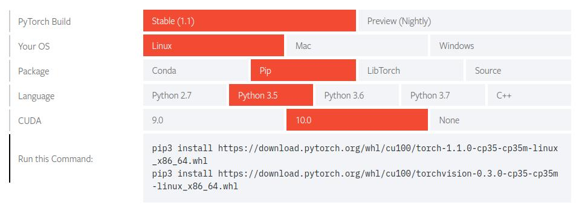

.. raw:: html
   
    <h1 align="center"> Install Deep Learning Environment on UBUNTU </h1>
    
    
      
    
**Author: Truong Dong Do**

Documentation
-------------
Latest **documentation** is avaliable on `Read the
Docs <https://install-ubuntu-environment.readthedocs.io/en/latest/>`__

0. Create boot USB:
-----------------------
- Download Ubuntu 16.04 LTS
- Use Universal USB Installer to create boot USB (Ubuntu --> Fat32)

1. Boot option:
---------------
- Choose USB boot --> Install Ubuntu

2. DISK:
--------
- Chose something else option when installing.
- swap area: Ram
- ext4: /

3. Install Google Chrome:
---------------------------
- Download *Google Chrome.deb*

.. code:: bash

    $ sudo dpkg -i google-chrome-stable_current_amd64.deb
    $ sudo apt-get install -f

4. Install Teamviewer.
------------------------
- Download *Teamviewer.deb*

.. code:: bash

    $ sudo dpkg -i teamviewer_14.1.18533_amd64.deb
    $ sudo apt-get install -f
    
5. Install iBus-Unikey.
-----------------------
.. code:: bash

    $ sudo apt-get install ibus-unikey
    $ ibus restart

--> Text Entry --> Vietnamese(ibus)

.. code:: bash

    $ sudo reboot

6. Install Nvidia Driver
------------------------

- Setting --> Software & Updates --> Additional Drivers --> Nvidia -- Apply changes.
- Test NVIDIA Driver:

.. code:: bash

    $ nvidia-smi

Lam theo huong dan de cai tensorflow-gpu:(CUDA 10 + CuDNN 7)
=============================================================
- https://www.tensorflow.org/install/gpu
- https://www.pyimagesearch.com/2017/09/27/setting-up-ubuntu-16-04-cuda-gpu-for-deep-learning-with-python/

Check CUDA:

.. code:: bash

    $ ncvv --version

Check Tensorflow:

.. code:: python

    import tensorflow as tf
    tf.__version__
    hello = tf.constant('Hello, TensorFlow!')
    print(sess.run(hello))
    a = tf.constant(10)
    b = tf.constant(5)
    sess = tf.Session()
    exit()

7. Install VSCode
-----------------
- Download *VSCode.deb*

.. code:: bash 

    $ sudo dpkg -i code_...-.deb

8. Install GitKraken
--------------------

9. Install Sublime Text 3
-------------------------

.. code:: bash

    $ wget -qO - https://download.sublimetext.com/sublimehq-pub.gpg | sudo apt-key add -
    $ sudo apt-get install apt-transport-https
    $ echo "deb https://download.sublimetext.com/ apt/stable/" | sudo tee /etc/apt/sources.list.d/sublime-text.list
    $ sudo apt-get update
    $ sudo apt-get install sublime-text
    $ sudo apt-get autoremove

--> Install: Package Control
============================
- Ctrl + Shift + P
- Install --> Package Control --> Install Materialize, Materialize Theme
- Github Link:
    - https://github.com/CoreyMSchafer/dotfiles/tree/master/settings

- Go to Preferences --> Setings --> User:

- Preferences.sublime-settings:

.. code:: json
    
    {
        "bold_folder_labels": true,
        "caret_extra_width": 1,
        "caret_style": "phase",
        "close_windows_when_empty": false,
        "color_scheme": "Packages/Predawn/predawn.tmTheme",
        "copy_with_empty_selection": false,
        "drag_text": false,
        "draw_minimap_border": true,
        "draw_white_space": "none",
        "enable_tab_scrolling": false,
        "ensure_newline_at_eof_on_save": true,
        "file_exclude_patterns":
        [
            "*.pyc",
            "*.pyo",
            "*.exe",
            "*.dll",
            "*.obj",
            "*.o",
            "*.a",
            "*.lib",
            "*.so",
            "*.dylib",
            "*.ncb",
            "*.sdf",
            "*.suo",
            "*.pdb",
            "*.idb",
            ".DS_Store",
            "*.class",
            "*.psd",
            "*.sublime-workspace"
        ],
        "font_face": "Source Code Pro",
        "font_options":
        [
            "no_round"
        ],
        "font_size": 14,
        "highlight_line": true,
        "highlight_modified_tabs": true,
        "ignored_packages":
        [
            "ActionScript",
            "AppleScript",
            "ASP",
            "D",
            "Diff",
            "Erlang",
            "Graphviz",
            "Groovy",
            "HTML-CSS-JS Prettify",
            "Lisp",
            "Lua",
            "Objective-C",
            "OCaml",
            "Rails",
            "Ruby",
            "Vintage"
        ],
        "installed_packages":[
            "Anaconda",
            "BracketHighlighter",
            "Material Theme",
            "Predawn",
            "SideBarEnhancements"
        ],
        "line_padding_bottom": 1,
        "line_padding_top": 1,
        "match_brackets_content": false,
        "match_selection": false,
        "match_tags": false,
        "material_theme_accent_graphite": true,
        "material_theme_compact_sidebar": true,
        "mini_diff": false,
        "open_files_in_new_window": false,
        "overlay_scroll_bars": "enabled",
        "preview_on_click": false,
        "scroll_past_end": true,
        "scroll_speed": 5.0,
        "show_definitions": false,
        "show_encoding": true,
        "show_errors_inline": false,
        "show_full_path": false,
        "sidebar_default": true,
        "swallow_startup_errors": true,
        "theme": "Material-Theme-Darker.sublime-theme",
        "translate_tabs_to_spaces": true,
        "trim_trailing_white_space_on_save": true,
        "use_simple_full_screen": true,
        "word_wrap": false
    }
10. Install PyTorch
-------------------------
- `PyTorch <https://pytorch.org/get-started/locally/>`__

.. code:: bash

	$ pip3 install https://download.pytorch.org/whl/cu100/torch-1.1.0-cp35-cp35m-linux_x86_64.whl
   	$ pip3 install https://download.pytorch.org/whl/cu100/torchvision-0.3.0-cp35-cp35m-linux_x86_64.whl
	

